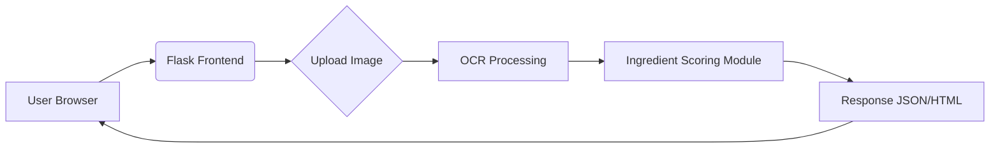

# HormoneImpactScanner
A tool that analyzes product ingredient lists (from images) to determine if they are suitable for people with hormonal conditions like PCOS/PCOD. The backend uses OCR to read labels and scores items based on sugar, refined carbs, and other risk factors. The application can be extended for lactose intolerance, gluten sensitivity, and more.

## 🚀 Tech Stack
- Python 3.11+
- Flask (web server) with Flask-CORS
- pytesseract & Tesseract OCR for text extraction
- Pillow for image handling
- HTML/CSS/JavaScript frontend (served with Flask templates)

## ✅ Features
1. Upload product label images and extract text via OCR
2. Detect whether product is **cosmetic** or **food**
3. Score nutritional risk for PCOS-friendly foods
4. Highlight high‑risk ingredients and offer suggestions
5. Auto classify products with color‑coded warnings
6. Suggestions for healthier alternatives
7. Easily extendable ingredient databases

## 📦 Installation
```bash
# clone/fetch repository
pip install -r requirements.txt
# ensure Tesseract OCR is installed on your system and the path is set in app.py
```

## ▶️ Running the app
```bash
python app.py
# or flask run if FLASK_APP is configured
```

## 🖼️ Screenshots
1. **Home page** – upload form and instructions
   
2. **Analysis result** – score, detected risks
   
3. **Ingredient details** – high/low risk lists
   

*(Replace above image links with actual screenshots in the `docs/screenshots` folder.)*

## 🎬 Demo Video
[Watch the demo](https://youtu.be/your-demo-video-link)

## 🏗️ Architecture Diagram


## 🧪 API Documentation
### `POST /analyze`
- **Parameters:** `image` (file) 
- **Response:** JSON with fields `score`, `risk_level`, `high_risk_items`, etc.

## ✨ Project Checklist

### Required Files in Root
- [x] README.md
- [x] LICENSE
- [x] .gitignore
- [x] requirements.txt

### README Requirements
- [x] Project description
- [x] Tech stack list
- [x] Features list (4+)
- [x] Installation commands
- [x] Run commands
- [ ] 3+ screenshots
- [ ] Demo video link
- [x] Architecture diagram
- [x] API docs (if backend exists)
- [x] Team members
- [x] License info

### Folder Structure
- [x] src/ or app/ (Flask app structure)
- [x] public/ or static/ (HTML templates)
- [x] docs/ (for diagrams)
- [x] Lowercase folder names only
- [x] No spaces in filenames

### Deployment
- [x] Live link works (https://hormone-impact-scanner.onrender.com)
- [x] Uses HTTPS
- [x] No errors on load

### Code Quality
- [x] Has comments explaining logic
- [x] Organized in folders
- [x] No giant files (modular structure)

### Git Commits
- [x] Meaningful commit messages
- [x] Multiple commits across development
- [x] AI tools documented (GitHub Copilot used for code generation)

## 👥 Team Members
- San A. (sanapm) – Developer
- <Add additional members here>

## 📄 License
This project is licensed under the [MIT License](LICENSE).

---

*Feel free to customize and expand this README with real screenshots, video link, and team info.*
